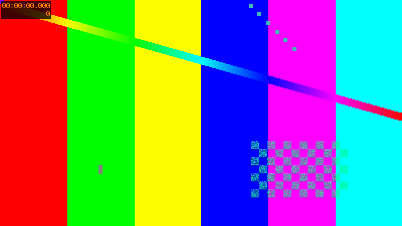

# Projeto de teste do Claude Deck

Pasta usada nos testes automáticos. Tem **um arquivo de cada tipo** para conferir os visualizadores.



## Tabela

| Tipo | Arquivo | Visualizador |
|------|---------|--------------|
| Vídeo | `media/teste.mp4` | player com busca |
| Áudio | `media/tom.wav` | forma de onda |
| JSON | `data/config.json` | árvore |

## Código

```ts
export function soma(a: number, b: number): number {
  return a + b;
}
```

- [x] Markdown com lista de tarefas
- [ ] Item pendente

> Citação: links relativos como [o app](src/app.ts) abrem no editor.

Veja também [a página HTML](site/index.html) e o site externo <https://code.claude.com>.
